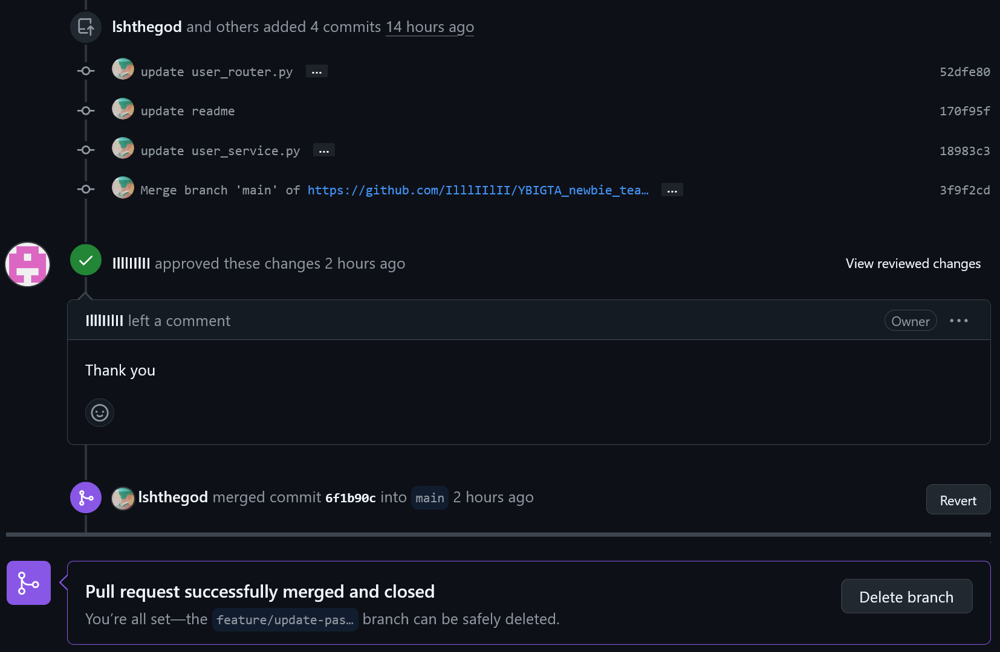

# 팀 소개

저희 팀은  4조 이경민, 이서현, 김형진입니다. 
함께 협력하며 최고의 결과물을 만들어내기 위해 노력하고 있습니다.

## 팀원 소개

### 팀원 1 - 이경민
ex)안녕하세요! 저는 백엔드 개발자 홍길동입니다.  
Python과 Django를 주로 사용하며, 효율적인 코드와 클린 아키텍처에 관심이 많습니다.  
새로운 기술을 배우고 프로젝트에 적용하는 것을 즐깁니다.

### 팀원 2 - 이서현 
안녕하세요! 컴퓨터과학과 23학번 이서현입니다.  
신입 교육 세션 다들 화이팅~!

### 팀원 3 - 김형진
ex ) 안녕하세요! 응용통계학과 20학번 김형진입니다.  
26기 모두들 화이팅!

### 팀 사진
저희 팀 사진입니다.

